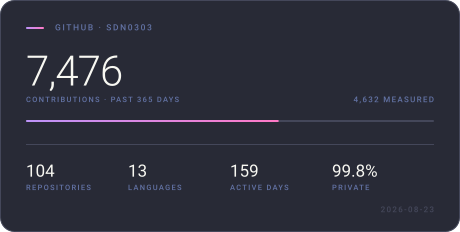
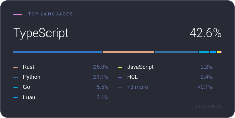
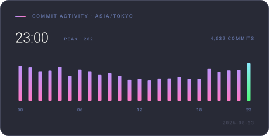

## Hi, I'm David 👋 👨‍💻

```go
package me

type Me struct {
	Job      string
	Email    string
	Learning []string
	Interest []string
}

func sdn0303() *Me {
	return &Me{
		Job:      "Software Developer",
		Email:    "sdn03.tech@gmail.com",
		Learning: []string{"GameProgramming", "3DModeling"},
		Interest: []string{"IoT", "AR/MR", "Blockchain", "LLM"},
	}
}
```

|Github Stats|Top Lang|Productive Time|
|:---:|:---:|:---:|
||||
